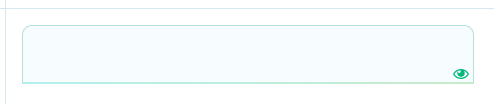

First of all, thank you very much for helping out the project! 🙂

This little document has a few important things to always keep in mind when doing Plante translation, and some general advice.

# How to start translating the app

1. Join our Discord: https://discord.gg/kXgXrTVpGY
2. Tell us on Discord that you'd like to help with translation!
3. We'll give you a link to the localization project on Poeditor

# How to translate

## General advice

The main thing which makes a good translation good is that such a translation is not a word-by-word transfer from one language to another.
A good translations rather tranfers the meaning from original text, letting itself to do little rewordings here and there, to make sentances more appropriate for the target language.

## Placeholders

Some of the strings have pieces in triangle brackets (e.g. `<PRODUCT>`, `<SHOP>`).
These are placeholders for actual names of some entities - for names of products, for names of shops.
Such pieces **should not** be translated, but they should be used in the translated text as if they are some actual names.

## Punctuation

Different languages have different punctuation. Keeping the original (English) text punctiation is not necessary - the appropriate punctuation of the target language should rather be used. For example, the Greek lang uses `;` instead of `?`, different languages use different kinds of quotation marks (`"`, `'`, `«`, ...).

## Plurals

When in Poeditor you see a weird text like:
```
{count, plural, =0{this year} =1{1 year ago} other{{count} years ago}}
```
...that means you've encountered a plural string!

Different languages have different rules for grammatical agreement with plurals. In English, for example, the quantity 1 is a special case. We write "1 month", but for any other quantity we'd write "n monts". This distinction between singular and plural is very common, but other languages make finer distinctions.

For example, Polish plurals for "month":
- one: 1 miesiąc
- few: 2 miesiące
- many: 5 miesięcy
- other: 1,5 miesiąca

Here you can find the description for the language that insterests you: https://www.unicode.org/cldr/charts/43/supplemental/language_plural_rules.html

To add translations for each of the plural form click the eye icon in Poeditor: 


